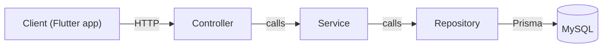
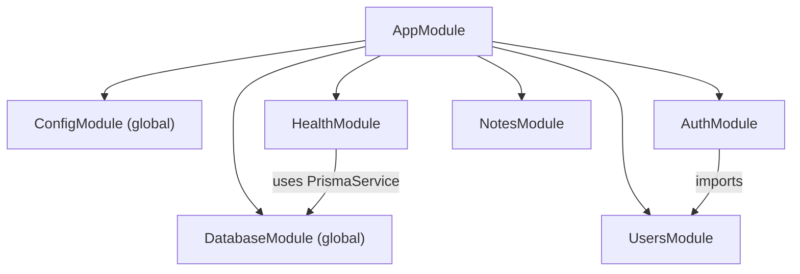

# Architecture

Notely is a modular NestJS application with a layered design. This document explains how the code
is organized and how a request flows through it.

## Layers



| Layer          | Responsible for                                                            | Must never                                       |
| -------------- | -------------------------------------------------------------------------- | ------------------------------------------------ |
| **Controller** | Routing, status codes, reading params/body/current user, calling a service | Contain business rules or access the database    |
| **Service**    | Business rules (ownership, uniqueness, token rotation), domain errors      | Know about HTTP (`Request`, `Response`, headers) |
| **Repository** | Database queries, always scoped to the owner where relevant                | Make business decisions                          |

Each layer only depends on the layer directly below it. Services know nothing about HTTP, so the
same business logic could serve REST, GraphQL or a background job. See
[ADR 0005](adr/0005-repository-pattern.md) for why repositories wrap Prisma.

## Modules



| Module           | Status | Purpose                                                                         |
| ---------------- | ------ | ------------------------------------------------------------------------------- |
| `ConfigModule`   | Done   | Validated, typed environment configuration (global)                             |
| `DatabaseModule` | Done   | `PrismaService`: one Prisma client and connection pool per process (global)     |
| `LoggerModule`   | Done   | pino structured logging, request IDs, redaction                                 |
| `CommonModule`   | Done   | Global validation pipe, exception filter and response envelope (`APP_*` tokens) |
| `HealthModule`   | Done   | Liveness (`/health`) and readiness with a database check (`/health/ready`)      |
| `UsersModule`    | Done   | User records and `GET /users/me`; exports `UsersService` for `AuthModule`       |
| `AuthModule`     | Done   | Register, login, refresh rotation, logout; registers the global auth guard      |
| `NotesModule`    | Done   | Notes CRUD with pagination, search and soft delete, scoped to the owner         |

Rules:

- Dependencies point **one way**. `AuthModule` imports `UsersModule`; `UsersModule` never imports
  `AuthModule`. Circular imports are rejected by the linter (`import/no-cycle`).
- Only infrastructure modules (configuration and the database) are global. Feature modules
  must be imported explicitly, so dependencies stay visible.

## Request lifecycle


| Stage             | Used for (in this project)                                                        |
| ----------------- | --------------------------------------------------------------------------------- |
| Middleware        | Request ID, HTTP logging (pino), security headers, CORS, JSON-only body parsing   |
| Guards            | JWT authentication (global, opt-out with `@Public()`), auth rate limiting         |
| Interceptors      | Wrapping responses in `{ data }` / `{ data, meta }`                               |
| Pipes             | Global DTO validation (whitelist, reject unknown fields), `ParseUUIDPipe`         |
| Exception filters | `AllExceptionsFilter`: one error shape with `requestId`; 5xx details only in logs |

Guards run **before** pipes, so an unauthenticated request is rejected before its body is even
validated.

## Routing and versioning

All routes are served under `/api/v{version}`, e.g. `/api/v1/notes`. Versioning is URI-based with a
default version of `1` ([ADR 0006](adr/0006-uri-api-versioning.md)).

App-wide HTTP settings (logger, security headers, CORS, body size limit, trusted proxy, prefix, versioning, shutdown hooks) live in `configureApp()` in
[`src/app.setup.ts`](../src/app.setup.ts). Both `main.ts` and the e2e tests call it, so tests run
the application exactly as production does.

## Folder structure

```text
src/
├── main.ts                  # Bootstrap: create app, configureApp(), listen
├── app.setup.ts             # configureApp(): logger, helmet, CORS, body limit, prefix, versioning
├── app.module.ts            # Root module: config + feature modules
├── common/
│   ├── common.module.ts     # Registers pipe, filter and interceptor globally
│   ├── decorators/          # @SkipEnvelope(), @Public()
│   ├── guards/              # RateLimitGuard for credential endpoints
│   ├── dto/                 # PaginatedResult
│   ├── filters/             # AllExceptionsFilter + exception mapping
│   ├── http/                # Request ID handling
│   ├── interceptors/        # Response envelope
│   └── validation/          # ValidationPipe factory + ValidationException
├── config/
│   └── env.schema.ts        # Zod schema, Env type, validateEnv()
├── database/
│   ├── database-connection.ts  # DATABASE_URL -> driver pool settings
│   ├── prisma.service.ts    # Prisma client: fail-fast startup, clean shutdown, health
│   ├── prisma-errors.ts     # Prisma error codes -> HTTP (safety net)
│   ├── escape-like.ts       # Literal matching for user search input
│   └── database.module.ts   # Global infrastructure module
├── generated/prisma/        # Generated Prisma client (gitignored)
├── logger/                  # pino configuration and LoggerModule
└── modules/
    ├── health/              # Reference implementation of the layers
    │   ├── interfaces/
    │   ├── health.controller.ts
    │   ├── health.service.ts
    │   └── health.module.ts
    ├── auth/                # Tokens, sessions, password hashing, global JwtAuthGuard
    ├── users/               # User records and profile endpoint
    └── notes/               # Owner-scoped notes CRUD (see ADR 0013)
prisma/
├── schema.prisma            # Data model (source of truth)
├── migrations/              # Versioned SQL migrations
└── seed.ts                  # Idempotent development seed
test/                        # End-to-end tests (+ utils/create-test-app.ts)
docs/                        # API contract, ERD, ADRs, guides
scripts/db/                  # Local database setup
```

## Conventions

- **Feature-based folders:** everything for a feature lives in `src/modules/<feature>/`.
- **File names:** kebab-case with a role suffix: `notes.controller.ts`, `create-note.dto.ts`,
  `notes.repository.ts`.
- **Tests:** unit tests sit next to the code (`*.spec.ts`); end-to-end tests live in `test/`
  (`*.e2e-spec.ts`).
- **Imports:** relative paths with explicit `.js` extensions (ES modules). No barrel `index.ts`
  files, because they hide circular dependencies.
- **Configuration:** read through `ConfigService<Env, true>`, never `process.env` directly.
- **Database access:** only repositories (and `PrismaService` itself) talk to Prisma. Never import the
  generated client in controllers or services.
- **Responses:** controllers return plain values; the envelope interceptor adds `{ data }`. Lists return
  a `PaginatedResult`. Infrastructure endpoints use `@SkipEnvelope()`.
- **Serialization:** never return database records. Map them to response DTOs with explicit functions
  (`toUserResponse(user)`). `@Exclude()` does not work on the plain objects Prisma returns.
- **Errors:** services throw Nest HTTP exceptions for expected cases (`NotFoundException`,
  `ConflictException`). Never catch-and-format errors in controllers; the global filter does it.
- **Logging:** use Nest's `Logger`, never `console.log`. Don't log secrets or whole request bodies.
- **Authentication:** every route requires an access token unless marked `@Public()`. Controllers get
  the caller through `@CurrentUser()` and never read the raw request. Tokens and sessions are
  described in [ADR 0011](adr/0011-jwt-access-tokens-with-rotating-opaque-refresh-tokens.md).
- **Authorization:** repositories take the owner's ID on every method and never load user data by
  ID alone. Another user's resource is a `404`, never a `403`
  ([ADR 0013](adr/0013-notes-access-pagination-and-soft-delete.md)).
- **Optional fields:** use `@IsOptionalNotNull()` rather than `@IsOptional()` for fields backed by
  `NOT NULL` columns, so `null` is rejected with 400 instead of failing in the database.
