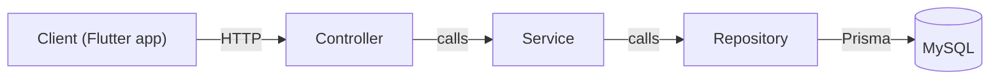
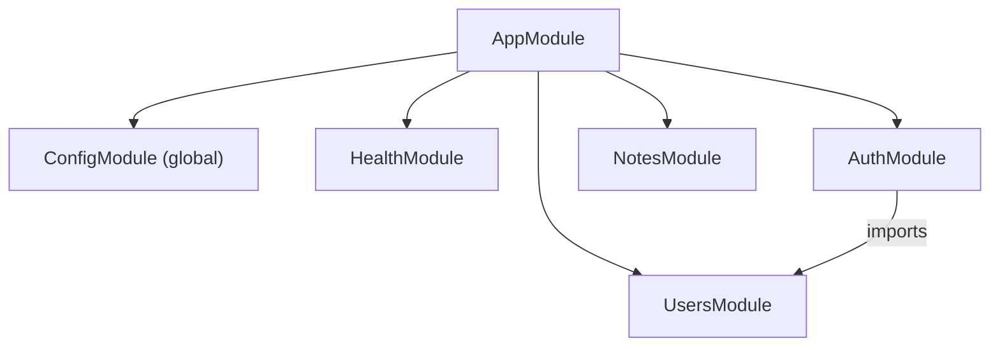
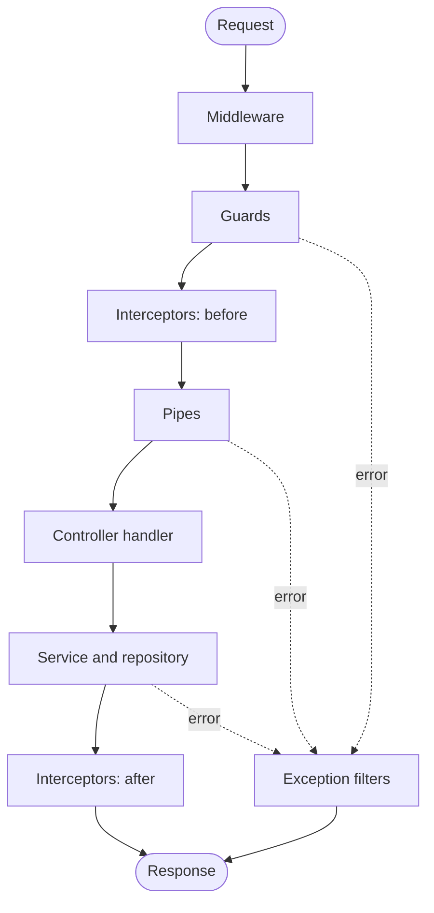

# Architecture

Notely is a modular NestJS application with a layered design. This document explains how the code
is organized and how a request flows through it.

## Layers



| Layer          | Responsible for                                                            | Must never                                       |
| -------------- | -------------------------------------------------------------------------- | ------------------------------------------------ |
| **Controller** | Routing, status codes, reading params/body/current user, calling a service | Contain business rules or access the database    |
| **Service**    | Business rules (ownership, uniqueness, token rotation), domain errors      | Know about HTTP (`Request`, `Response`, headers) |
| **Repository** | Database queries, always scoped to the owner where relevant                | Make business decisions                          |

Each layer only depends on the layer directly below it. Services know nothing about HTTP, so the
same business logic could serve REST, GraphQL or a background job. See
[ADR 0005](adr/0005-repository-pattern.md) for why repositories wrap Prisma.

## Modules



| Module         | Status  | Purpose                                                          |
| -------------- | ------- | ---------------------------------------------------------------- |
| `ConfigModule` | Done    | Validated, typed environment configuration (global)              |
| `HealthModule` | Done    | `GET /api/v1/health` liveness endpoint; reference implementation |
| `UsersModule`  | Planned | User profile; exports `UsersService` for `AuthModule`            |
| `AuthModule`   | Planned | Register, login, token refresh, logout                           |
| `NotesModule`  | Planned | Notes CRUD, scoped to the authenticated user                     |

Rules:

- Dependencies point **one way**. `AuthModule` imports `UsersModule`; `UsersModule` never imports
  `AuthModule`. Circular imports are rejected by the linter (`import/no-cycle`).
- Only infrastructure modules (configuration, and later the database) are global. Feature modules
  must be imported explicitly, so dependencies stay visible.

## Request lifecycle



| Stage             | Used for (in this project)                            |
| ----------------- | ----------------------------------------------------- |
| Middleware        | Request ID, HTTP logging                              |
| Guards            | JWT authentication (global, opt-out with `@Public()`) |
| Interceptors      | Wrapping responses in `{ data }`, timing              |
| Pipes             | DTO validation and transformation, `ParseUUIDPipe`    |
| Exception filters | One consistent error response shape                   |

Guards run **before** pipes, so an unauthenticated request is rejected before its body is even
validated.

## Routing and versioning

All routes are served under `/api/v{version}`, e.g. `/api/v1/notes`. Versioning is URI-based with a
default version of `1` ([ADR 0006](adr/0006-uri-api-versioning.md)).

App-wide settings (prefix, versioning, shutdown hooks) live in `configureApp()` in
[`src/app.setup.ts`](../src/app.setup.ts). Both `main.ts` and the e2e tests call it, so tests run
the application exactly as production does.

## Folder structure

```text
src/
├── main.ts                  # Bootstrap: create app, configureApp(), listen
├── app.setup.ts             # configureApp(): prefix, versioning, shutdown hooks
├── app.module.ts            # Root module: config + feature modules
├── config/
│   └── env.schema.ts        # Zod schema, Env type, validateEnv()
└── modules/
    ├── health/              # Reference implementation of the layers
    │   ├── interfaces/
    │   ├── health.controller.ts
    │   ├── health.service.ts
    │   └── health.module.ts
    ├── auth/
    ├── users/
    └── notes/
test/                        # End-to-end tests
docs/                        # API contract, ERD, ADRs, guides
scripts/db/                  # Local database setup
```

`common/` (guards, filters, interceptors, decorators) and `database/` (Prisma) are added when
their first real code is written.

## Conventions

- **Feature-based folders:** everything for a feature lives in `src/modules/<feature>/`.
- **File names:** kebab-case with a role suffix: `notes.controller.ts`, `create-note.dto.ts`,
  `notes.repository.ts`.
- **Tests:** unit tests sit next to the code (`*.spec.ts`); end-to-end tests live in `test/`
  (`*.e2e-spec.ts`).
- **Imports:** relative paths with explicit `.js` extensions (ES modules). No barrel `index.ts`
  files, because they hide circular dependencies.
- **Configuration:** read through `ConfigService<Env, true>`, never `process.env` directly.
