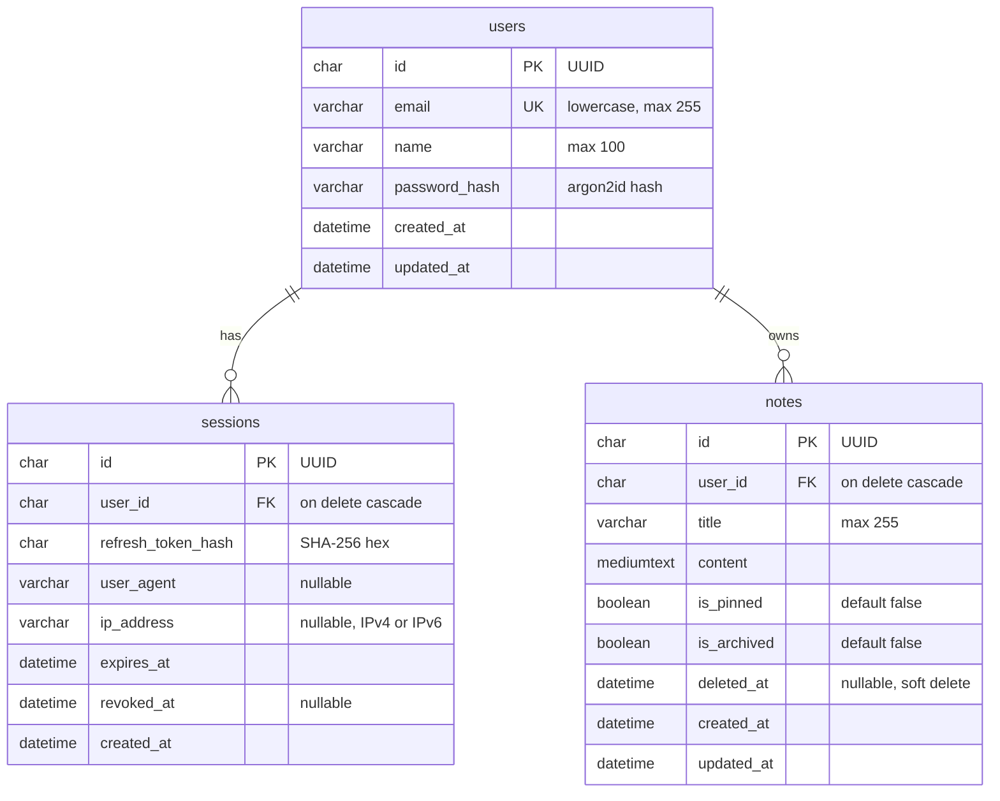

# Entity Relationship Diagram

> **Status:** Draft. This will be implemented with Prisma in Phase 3.

## Relationships

| Relationship         | Type        | On delete                                       |
| -------------------- | ----------- | ----------------------------------------------- |
| `users` → `sessions` | one-to-many | Cascade: deleting a user removes their sessions |
| `users` → `notes`    | one-to-many | Cascade: deleting a user removes their notes    |

## Indexes

| Table      | Index                               | Why                                                                 |
| ---------- | ----------------------------------- | ------------------------------------------------------------------- |
| `users`    | unique `email`                      | Login lookup, and it enforces one account per email                 |
| `sessions` | `user_id`                           | Used by "logout from all devices"                                   |
| `notes`    | `(user_id, deleted_at, updated_at)` | Matches the most common query: "my non-deleted notes, newest first" |

## Column type decisions

| Column               | Type                 | Reason                                                                                          |
| -------------------- | -------------------- | ----------------------------------------------------------------------------------------------- |
| All `id` columns     | `CHAR(36)` UUID      | Non-guessable IDs prevent enumeration (`/notes/5` → `/notes/6`)                                 |
| `password_hash`      | `VARCHAR(255)`       | argon2id hashes are around 100 chars; leaves room for algorithm changes                         |
| `refresh_token_hash` | `CHAR(64)`           | A SHA-256 hex digest is always exactly 64 chars                                                 |
| `ip_address`         | `VARCHAR(45)`        | Longest textual IPv6 form (IPv4-mapped) is 45 chars                                             |
| `content`            | `MEDIUMTEXT`         | `TEXT` holds 65,535 **bytes**; with `utf8mb4` (up to 4 bytes per char) 50,000 chars may not fit |
| Timestamps           | `DATETIME(3)` in UTC | Millisecond precision; UTC avoids timezone bugs. Clients convert to local time                  |
| Table/column names   | `snake_case`         | MySQL convention; Prisma models stay `PascalCase` / `camelCase` via `@@map` / `@map`            |
